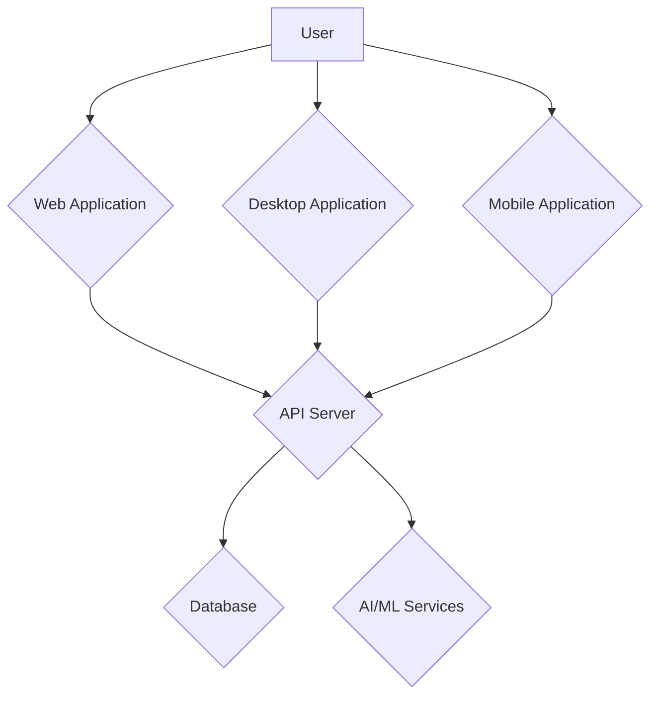

# System Architecture

This document provides a high-level overview of the system architecture for the Audio/Video Transcription & Analysis Platform.

## Components

The platform is composed of the following main components:

-   **Web Application**: A Streamlit-based web application that provides the primary user interface for the platform.
-   **API Server**: A FastAPI-based REST API that provides the backend services for the platform.
-   **Desktop Application**: An Electron-based desktop application that provides a native desktop experience.
-   **Mobile Application**: A React Native-based mobile application that provides a mobile experience.
-   **Database**: A PostgreSQL database that stores the platform's data.
-   **AI/ML Services**: A collection of AI/ML services that provide the platform's core functionality, including transcription, speaker diarization, and named entity recognition.

## Data Flow

The following diagram illustrates the data flow between the platform's components:

## Technology Stack

-   **Backend**: Python, FastAPI, SQLAlchemy
-   **Frontend**: Streamlit, React (for desktop and mobile apps)
-   **Database**: PostgreSQL
-   **AI/ML**: OpenAI, spaCy, Pyannote
-   **Deployment**: Docker, Docker Compose
